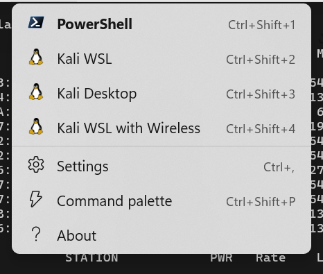
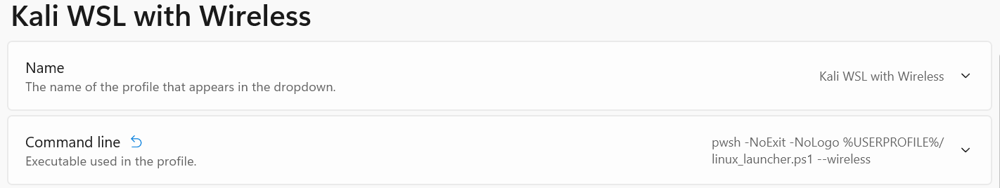

= Kali WSL2 - Using Wireless Cards under WSL
:toc:
:card: RT5572

This tutorial demonstrates how to connect USB Network Cards to a WSL2 installation.

NOTE: This is a more digestible explanation of the guide created https://github.com/kevin-doolaeghe/wsl-kernel-modules[here].

== Explanation
It is possible to connect a wireless card to Kali Linux, albeit with a bit of dirty work.

There are four requirements for getting a network card working under WSL.

. We need to tell the Linux Kernel that we want support for the WLAN standard (802.11). We can't use the kernel that's shipped by default with WSL, so we need to roll our own to support it.
. We need to add the driver that supports your card. The driver for the {card} is included in the Linux Kernel, fortunately.
. We need to add the https://unix.stackexchange.com/questions/664625/[firmware] used by the network card to our WSL kernel.
. Finally, we can connect the network card, and forward it to WSL using https://github.com/dorssel/usbipd-win[usbipd-win].

== Driver support
The original tutorial adds support for the `rtl8812au` devices.
I bought a flavor of this card, but unfortunately, it **DOES NOT** support https://github.com/aircrack-ng/rtl8814au/issues/32[virtual interfaces], so Evil Twin attacks are not currently possible on it.


Then I purchased a cheap https://es.aliexpress.com/item/1005005534028548.html[{card}]. This one is supported under the Ralink driver included on the Linux Kernel

|===
| Possible compatible cards

| rt2500 (USB)
| rt2501/rt73 (USB)
| rt27xx/rt28xx/rt30xx (USB)
| rt33xx (USB)
| rt35xx (USB) (EXPERIMENTAL)
| rt3573 (USB) (EXPERIMENTAL)
| rt53xx (USB) (EXPERIMENTAL)
| rt55xx (USB) (EXPERIMENTAL)
|===


== Setup Kali WSL2

.Update the system:
```
sudo apt update && sudo apt upgrade
```

.Install packages:
```
sudo apt install bash-completion build-essential gcc g++ avr-libc avrdude default-jre default-jdk git clang make nano xz-utils usbip wget
source .bashrc
```

== Build and install a custom WSL2 kernel

We're going to build a kernel for WSL, and set some flags to compile the it with the support that we want.

.Install required packages for building the kernel:
```
sudo apt install flex bison libssl-dev libelf-dev git dwarves bc
```

.Download official WSL2 kernel and prepare the installation:
```
wget https://github.com/microsoft/WSL2-Linux-Kernel/archive/refs/tags/linux-msft-wsl-$(uname -r | cut -d- -f 1).tar.gz
tar -xvf linux-msft-wsl-$(uname -r | cut -d- -f 1).tar.gz
cd WSL2-Linux-Kernel-linux-msft-wsl-$(uname -r | cut -d- -f 1)
cat /proc/config.gz | gunzip > .config
make prepare modules_prepare -j $(expr $(nproc) - 1)
```

.Open the kernel's configuration
```
make menuconfig -j $(expr $(nproc) - 1)
```

In this menu, we will add support for `cfg80211`, for your device driver, and we will point the kernel to the firmware.
Turn on the following flags:

     | Symbol: CFG80211 [=m]                                                       │
     │ Type  : tristate                                                            │
     │ Defined at net/wireless/Kconfig:20                                          │
     │   Prompt: cfg80211 - wireless configuration API                             │
     │   Depends on: NET [=y] && WIRELESS [=y] && (RFKILL [=n] || !RFKILL [=n])    │
     │   Location:                                                                 │
     │     -> Networking support (NET [=y])                                        │
     │ (1)   -> Wireless (WIRELESS [=y])                                           │
     │ Selects: FW_LOADER [=y] && CRC32 [=y] && CRYPTO_SHA256 [=y]

https://linux-hardware.org/?id=usb:148f-5572[Flags needed for {card}]

     │ Symbol: WLAN [=y]                                                           │
     │ Type  : bool                                                                │
     │ Defined at drivers/net/wireless/Kconfig:6                                   │
     │   Prompt: Wireless LAN                                                      │
     │   Depends on: NETDEVICES [=y] && !S390 && NET [=y]                          │
     │   Location:                                                                 │
     │     -> Device Drivers                                                       │
     │ (1)   -> Network device support (NETDEVICES [=y])                           │
     │ Selects: WIRELESS [=y]                                                      │

     │ Symbol: RT2800USB_RT55XX [=y]                                               │
     │ Type  : bool                                                                │
     │ Defined at drivers/net/wireless/ralink/rt2x00/Kconfig:183                   │
     │   Prompt: rt2800usb - Include support for rt55xx devices (EXPERIMENTAL)     │
     │   Depends on: NETDEVICES [=y] && WLAN [=y] && WLAN_VENDOR_RALINK [=y] && \  │
     │ RT2X00 [=m] && RT2800USB [=m]                                               │
     │   Location:                                                                 │
     │     -> Device Drivers                                                       │
     │       -> Network device support (NETDEVICES [=y])                           │
     │         -> Wireless LAN (WLAN [=y])                                         │
     │           -> Ralink devices (WLAN_VENDOR_RALINK [=y])                       │
     │             -> Ralink driver support (RT2X00 [=m])                          │
     │               -> Ralink rt27xx/rt28xx/rt30xx (USB) support (RT2800USB [=m])

I didn't have any luck having the firmware load dynamically, so I decided to https://forums.gentoo.org/viewtopic-t-1074484-start-0.html[build it] in the kernel.
Set the following flags:

     │ Symbol: FW_LOADER [=y]                                                      │
     │ Type  : tristate                                                            │
     │ Defined at drivers/base/firmware_loader/Kconfig:4                           │
     │   Prompt: Firmware loading facility                                         │
     │   Visible if: EXPERT [=y]                                                   │
     │   Location:                                                                 │
     │     -> Device Drivers                                                       │
     │       -> Generic Driver Options                                             │
     │         -> Firmware loader                                                  │

Write the name of the firmware for your card here:

     │ Symbol: EXTRA_FIRMWARE [=rt2870.bin]                                        │
     │ Type  : string                                                              │
     │ Defined at drivers/base/firmware_loader/Kconfig:32                          │
     │   Prompt: Build named firmware blobs into the kernel binary                 │
     │   Depends on: FW_LOADER [=y]                                                │
     │   Location:                                                                 │
     │     -> Device Drivers                                                       │
     │       -> Generic Driver Options                                             │
     │         -> Firmware loader                                                  │
     │           -> Firmware loading facility (FW_LOADER [=y])                     │

And put the dir where the firmwar is located:

  │ Symbol: EXTRA_FIRMWARE_DIR [=/lib/firmware]                                 │
  │ Type  : string                                                              │
  │ Defined at drivers/base/firmware_loader/Kconfig:63                          │
  │   Prompt: Firmware blobs root directory                                     │
  │   Depends on: FW_LOADER [=y] && EXTRA_FIRMWARE [=rt2870.bin]!=              │
  │   Location:                                                                 │
  │     -> Device Drivers                                                       │
  │       -> Generic Driver Options                                             │
  │         -> Firmware loader                                                  │
  │           -> Firmware loading facility (FW_LOADER [=y])                     │
  │             -> Build named firmware blobs into the kernel binary (EXTRA_FIR │

.Install the firmware
[source, bash]
sudo apt install firmware-ralink

You can also download the `.bin` manually and place in the the dir that you've determined above.

.Build and install modules:
[source, bash]
sudo make modules -j $(expr $(nproc) - 1)
sudo make modules_install
sudo make -j $(expr $(nproc) - 1)
sudo make install

NOTE: Kernel headers are going to be installed in the `/lib/modules/` directory.

.Copy the built kernel image to `C:\Users\<User>\`:
```
cp vmlinux /mnt/c/Users/Kevin/
```

.Create a `.wslconfig` file to declare the new kernel:
```
nano /mnt/c/Users/Kevin/.wslconfig
```

.Paste the following content into this file:
```
[wsl2]
kernel=C:\\Users\\Kevin\\vmlinux
```

.Switch to Powershell and shutdown running WSL2 distros:
```
wsl --shutdown
```
:triangular_flag_on_post: When a WSL2 distro will be rebooted, the default WSL2 kernel located in `C:\Windows\System32\lxss\tools\kernel` will be replaced by the newly built kernel.

=== Compile and load a kernel module (`rtl8812au` only)

NOTE: This example illustrates how to build and load the `rtl8812au` module to the WSL2 kernel. If you built the driver and firmware into the kernel above, this won't be neccesary.

.Clone the `aircrack-ng/rtl8812au` Github repository:
```
git clone https://github.com/aircrack-ng/rtl8812au
cd rtl8812au
```

.Build the module with the new kernel headers:
```
sudo make
```

NOTE: This command generates a `.ko` file which corresponds to the built module.

WARNING: The headers must be installed in the `/lib/modules/$(uname -r)/build` directory.

NOTE: You can check your WSL2 version by running `uname -r`.

.Enable `cfg80211` and `88XXau.ko` modules:
```
sudo modprobe cfg80211
sudo insmod 88XXau.ko
lsmod
```
:warning: `cfg80211` module must be loaded before `88XXau.ko`.

.Install the module:
```
sudo mkdir -p /lib/modules/$(uname -r)/kernel/drivers/net/wireless
sudo make install
```

NOTE: Now, `sudo modprobe 88XXau` command will work.

.Enable the module:
```
sudo modprobe 88XXau
```

== Using the Network Adapter

.Attach a USB device using `usbip` from Powershell:
[source, powershell]
usbipd wsl attach --busid=2-7

.Enable the modules for WLAN and devices
[source,bash]
sudo modprobe cfg80211 && sudo modprobe rt2800usb

.Install `aircrack-ng` packages:
[source,bash]
sudo apt install aircrack-ng pciutils

.Set the adapter in monitor mode:
[source,bash]
sudo airmon-ng start wlan0

.Search WEP networks with `airodump-ng`:
[source,bash]
sudo airodump-ng wlan0mon --encrypt WPA


.Disable monitor mode on `wlan0` interface:
[source,bash]
airmon-ng stop wlan0

== The Startup Script

I use this nice script so that I can just simply tab open a new Kali WSL with Wireless from Windows Terminal.



[source, powershell]
----
# WSL Launcher
if ($args[0] -eq "--wireless") {
  # This line starts wsl before calling usbipd
  wsl -- echo "Enabling usbpid device..."
  usbipd wsl attach --busid=2-7

  wsl bash -c "
    echo 'Enabling drivers...';
    sudo modprobe cfg80211 && sudo modprobe rt2800usb;

    echo 'Setting interface to monitor mode...';
    sudo airmon-ng start wlan0;
    echo 'SUCCESS' && clear;
    exec zsh;
  "
} elseif ($args[0] -eq "--desktop") {
  # Code for --desktop flag
  wsl -d kali-linux kex --sl --wtstart -s
  exit;
} else {
  # Handle invalid flags or missing arguments
  Write-Host "Invalid flag or missing argument. Please use either --wireless or --desktop."
  exit;
}
----
You can add the new Profile to WT like this. Drop the script above into a file and call it with the correct param.


